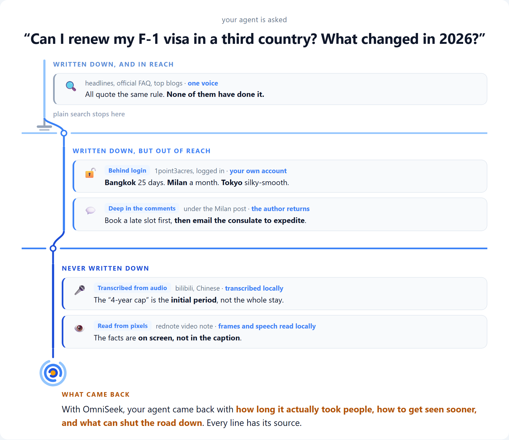

<!-- mcp-name: io.github.Battam1111/omniseek -->

<div align="center">

<picture>
  <source media="(prefers-color-scheme: light)" srcset="assets/logo-icon.png">
  
</picture>

# OmniSeek

**Your agent seeks what search can't find.**

The answer is sitting in minute 47 of a podcast, three replies deep in a comment thread, behind a login, in another language. Your agent gets it anyway.

<sub>Self-hosted perception MCP server · one connection</sub>

[](https://github.com/Battam1111/omniseek/actions/workflows/ci.yml)
&nbsp;[](./LICENSE)
&nbsp;
&nbsp;
&nbsp;

[Quick start](#quick-start) · [Tools](#tools) · [Configure](#configure) · [Contributing](#contributing)

**Languages:** English · [中文](docs/i18n/README_zh.md) · [日本語](docs/i18n/README_ja.md)

</div>

---

Search gives your agent indexed pages, in one language, in text, and stops there.

OmniSeek gives it the senses to keep going: through languages, logins, comment threads, audio, and pixels, all on your machine.

<div align="center">
  <picture>
    <source media="(prefers-color-scheme: dark)" srcset="assets/demo-en-dark.png">
    
  </picture>
</div>

What each layer gave back, verbatim:

- **Written down, and in reach.** Headlines, official FAQ, top blogs, all one voice: *"From 2026, F-1 admission is limited to a 4-year initial period; renewal in a third country remains possible."* All quote the same rule. None of them have done it.
- **Written down, but out of reach.** Three first-person threads on 1point3acres, behind your own login: **Bangkok**, booked to passport in 25 days, interview to approval in 30 minutes; **Milan**, a month-long fight for a slot, visa issued for 5 years; **Tokyo**, *"silky-smooth"*. Under the Milan post the author comes back in the comments: *"Book any late slot first, then email the consulate to expedite. For one F-1 applicant it worked."* One person's experience, not official guidance.
- **Never written down.** A Chinese explainer video on bilibili, transcribed locally: the *"4-year cap"* in the headlines is the initial period, extensions moved desks rather than vanishing. A rednote video note whose caption is four hashtags, frames and speech read locally: a 212(a)(6)(C) refusal abroad, a misrepresentation finding, can nearly close the F-1 road.

Plain search quoted the rule and stopped. The people who had lived it held the timelines, the workaround, and the risk. OmniSeek also named the sources it held back, each with the exact call to drill it.

It hears (local bilingual ASR, no cloud), sees (images and video frames, in-band), crosses languages (a Chinese query finds English results and vice versa), reads behind login walls (your credentials, your machine, off by default), and remembers (persistent retrieval memory plus a typed, source-traced evidence graph).

Crossing languages draws on the index OmniSeek builds as you use it, so a fresh install starts at a floor. The published claim-verification tests run on exactly that fresh install, which makes their cross-lingual number the coldest case rather than the typical one.

Every source in [the catalog](docs/sources.md), the curated roster of everything OmniSeek can reach, earned its place by beating plain search at one of five jobs (structure, unwalling, transcription, recall, monitoring): citation graphs, regulatory filings, login-walled forums, Chinese-language video. And the catalog is built to grow: a curator pipeline probes, judges, and admits new sources, and retires the ones that decay.

**[Worked examples, real outputs](docs/examples.md)** · **[A full case study](docs/case-study.md)** · **[Every claim above is a test](bench/DESIGN.md)** ([latest results](https://github.com/Battam1111/omniseek/blob/health-data/bench/RESULTS.md)) · **[Source health, updated weekly](https://github.com/Battam1111/omniseek/blob/health-data/README.md)**

---

## Quick start

### Docker (recommended)

```bash
git clone https://github.com/Battam1111/omniseek.git && cd omniseek
docker compose up -d
docker compose logs omniseek        # bearer token printed on first start
curl -s http://127.0.0.1:8765/healthz
```

Point your MCP client at `http://127.0.0.1:8765/mcp` with `Authorization: Bearer <token>`. The token is generated on first start and stored in `~/.omniseek/credentials/omniseek_http.json` (with the compose file, that's `./.omniseek/credentials/omniseek_http.json` on the host).

Two paths from here. The prebuilt core image (`docker pull ghcr.io/battam1111/omniseek`, amd64 + arm64) needs no build and carries every core sense; it is Apache-clean and ships without PDF reading, hearing (ASR + video frames), and login-walled sources. Wanting those extras is what triggers a local build: set `EXTRAS="[pdf,asr,walled]"` and run `docker compose build`, then `up -d` (the first build also fetches headless Chromium; later starts are instant). Optional but recommended: set `OMNISEEK_CONTACT_EMAIL` for a faster lane with Crossref, SEC, and Unpaywall.

### Without Docker

```bash
python -m venv .venv && . .venv/bin/activate
scripts/bootstrap.sh
python -m omniseek.serve_http
```

The bare install is the **Core** tier: every keyless API and static source, document reading minus PDF, and the lexical memory index. `pip install "omniseek[pdf,asr,recall,ocr]"` wakes the **Research** tier (PDF, hearing, cross-lingual vectors, OCR); `omniseek[walled]` adds the login-walled tier, which stays off until you bring your own accounts; `omniseek[all]` takes everything. The server prints which senses are online, and which are dormant, at every boot.

On Windows, run `bootstrap.sh` under Git Bash or WSL; Docker is the simplest path. For an always-on Linux service, see [`deploy/omniseek.service`](deploy/omniseek.service).

Prefer stdio? The install also ships an `omniseek` command that speaks MCP over stdio, for clients that launch servers themselves; [`Dockerfile.stdio`](Dockerfile.stdio) wraps the same thing in a container.

OmniSeek binds `127.0.0.1` and requires the bearer token on every request. Do not expose without a reverse proxy ([SECURITY.md](.github/SECURITY.md)).

---

## Tools

One MCP connection; no model, no agent loop inside. Your model thinks, your harness drives the loop, OmniSeek reaches. Start with `omniseek_search`; explore what's available with `omniseek_sources`.

| Tool | What it does |
|------|-------------|
| `omniseek_search` | Fan out across the whole catalog, deduplicate, rank. Cross-lingual (semantic + lexical). |
| `omniseek_read` | Normalize any URL or document (web page, PDF, arXiv) into clean text. |
| `omniseek_view` | Read images, document figures, video frames with vision. |
| `omniseek_transcribe` | Transcribe audio/video locally. Bilingual ASR, sliceable by timestamp. |
| `omniseek_field_skeleton` | Map a research field's citation neighborhood: foundational core vs. frontier. |
| `omniseek_resolve_identity` | Resolve a person's name to candidate author IDs across databases. |
| `omniseek_coauthors` | Map a researcher's collaboration network by joint-paper count. |
| `omniseek_institution_cohort` | List who actively publishes at a lab, scoped to a field. |
| `omniseek_paper_enrich` | Open-access PDF, retraction/integrity status, citation count for a paper. |
| `omniseek_paper_recommend` | Semantically similar papers (SPECTER embeddings) that keyword search misses. |
| `omniseek_graph` | Query the accumulated evidence graph: find, neighborhood, between, since, similar. |
| `omniseek_sensor` | Standing queries with novelty detection. Only tells you what is new. |
| `omniseek_ruling` | Record identity judgments (same/not-same) the graph applies at read time. |
| `omniseek_statement` | Record directed relations the graph carries forward. |
| `omniseek_curator_act` | Source lifecycle: submit, probe, judge, admit, retire. |
| `omniseek_curator_view` | Read the source-admission queue or a per-source audit dossier. |
| `omniseek_gather` | Run multiple tools in parallel, one response. |
| `omniseek_sources` | List and route: domains, regions, capabilities, health. |

The login-walled tier has no tool of its own: once you opt in per source, the same `omniseek_search(..., sources=["xiaohongshu"], raw=True)` runs through your own logged-in browser. See [walled sources](docs/walled-sources.md).

Full reference in **[tools.md](docs/tools.md)** · **[FAQ](docs/faq.md)**

Using Claude Code? [`skills/omniseek-investigate`](skills/omniseek-investigate/SKILL.md) ships the investigation methodology (sweep, zoom, structure) as a ready-made skill.

---

## Configure

OmniSeek is **catalog-first**: with no config, every benign source is on and login-walled sources are off. Tune in one file, `~/.omniseek/profile.json` ([example](deploy/profile.example.json)):

| Tier | Default |
|------|---------|
| **free** (public, no key) | **on** |
| **keyed** (a free or paid API key you supply) | on once the key is set |
| **walled** (a login you hold) | **off**; you bring your own browser |
| **circumvention** | **off**; none in the default pack |

Full reference: **[configuration](docs/configuration.md)** · **[walled sources](docs/walled-sources.md)** · **[legal posture](docs/LEGAL-POSTURE.md)**

---

## Why self-hosted

There is no OmniSeek cloud. No telemetry, no accounts, no relay: a query leaves your machine only as direct requests to the sources you enabled, and OmniSeek adds no other party to that path. Walled-source credentials stay in your own browser, presented only to the site they belong to; OmniSeek never stores, uploads, or even sees your passwords. The retrieval memory and evidence graph it accumulates over months are local files you own: stop running OmniSeek and you keep everything. Not a feature toggle. The architecture.

---

## Contributing

See [CONTRIBUTING.md](.github/CONTRIBUTING.md). The bar for a new source: it must beat plain web search via a mode (structure / unwall / transcribe / recall / monitor). The bar for fixing a decayed source: low, please do. `python tests/smoke.py` before you push.

By participating you agree to the [Code of Conduct](.github/CODE_OF_CONDUCT.md).

<div align="center">

---

**Your agent seeks what search can't find.**

[Apache-2.0](./LICENSE) · [NOTICE](./NOTICE) · [Security](.github/SECURITY.md) · [Cite](./CITATION.cff)

</div>
