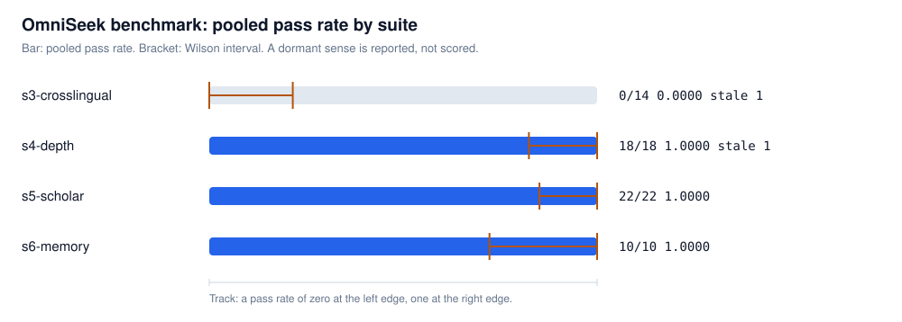

# OmniSeek benchmark results

<picture>
  <source media="(prefers-color-scheme: dark)" srcset="results-dark.svg">
  
</picture>

| Suite | n | rate [Wilson interval] | noise band | p50 ms | p90 ms | stale | dormant |
| --- | ---: | --- | ---: | ---: | ---: | ---: | --- |
| s3-crosslingual | 7 | 0.0000 [0.0000, 0.2153] | 0.0000 | n/a | n/a | 1 | no |
| s4-depth | 9 | 1.0000 [0.8241, 1.0000] | 0.0000 | 1181.78 | 14399.28 | 1 | no |
| s5-scholar | 11 | 1.0000 [0.8513, 1.0000] | 0.0000 | 5.75 | 1152.90 | 0 | no |
| s6-memory | 5 | 1.0000 [0.7225, 1.0000] | 0.0000 | 6.08 | 12.26 | 0 | no |

## Environment

```json
{
  "extras_detected": {
    "asr": false,
    "ocr": true,
    "pdf": true,
    "recall": true,
    "walled": false
  },
  "omniseek_version": "0.2.0",
  "platform": "Linux-6.17.0-1022-azure-x86_64-with-glibc2.39",
  "python": "3.11.15",
  "utc": "2026-08-16T19:03:43.868796+00:00",
  "vantage": "github-actions",
  "warmup_ms": 14900.474,
  "warmup_pass_ms": [
    7420.701,
    7479.773
  ]
}
```

## Stale task ids

- `s3-xling-007` (dead)
- `s4-depth-011` (rate_limited)

## Dormant suites

- none

## Reachability baseline

A task enters these suites only after a recorded query failed to surface its ground truth on the first page of a plain web search. Those receipts travel with the run, so the floor the rates above are measured against is on this page rather than buried in a task file.

| Suite | tasks carrying a receipt | tasks whose receipt records a first-page hit |
| --- | ---: | ---: |
| s3-crosslingual | 8 | 0 |
| s4-depth | 10 | 0 |

<details>
<summary>Recorded receipts, one line per logged query</summary>
<ul>
<li><code>s3-xling-001</code>: WebSearch on 2026-08-16, first-page hit no, query <code>不用同源序列比对,只靠蛋白质语言模型能挖出新的蛋白家族吗</code></li>
<li><code>s3-xling-002</code>: WebSearch on 2026-08-16, first-page hit no, query <code>空间转录组里协方差的非平稳性到底说明了什么</code></li>
<li><code>s3-xling-003</code>: WebSearch on 2026-08-16, first-page hit no, query <code>不靠参考序列,能用大量冗余的 de novo 肽段读段拼出蛋白序列吗</code></li>
<li><code>s3-xling-004</code>: WebSearch on 2026-08-16, first-page hit no, query <code>蛋白质语言模型是在哪一层学会二级结构这些概念的</code></li>
<li><code>s3-xling-005</code>: WebSearch on 2026-08-16, first-page hit no, query <code>单细胞差异表达到底是转录变化还是 mRNA 稳定性变化引起的</code></li>
<li><code>s3-xling-007</code>: WebSearch on 2026-08-16, first-page hit no, query <code>how can softmax attention be approximated by a gated delta rule linear attention</code></li>
<li><code>s3-xling-008</code>: WebSearch on 2026-08-16, first-page hit no, query <code>a general iterative scheme to approximate arbitrary matrix functions generalizing Newton-Schulz</code></li>
<li><code>s3-xling-009</code>: WebSearch on 2026-08-16, first-page hit no, query <code>Loss-Free load balancing with a sigmoid MoE gate versus softmax with Re-Norm after top-k</code></li>
<li><code>s4-depth-002</code>: WebSearch on 2026-08-16, first-page hit no, query <code>The Pile dataset Pile-CC Common Crawl WARC urls "3679 chunks" 22 random chunks</code></li>
<li><code>s4-depth-003</code>: WebSearch on 2026-08-16, first-page hit no, query <code>The Pile HackerNews component story ids first post to post number "24531712" BigQuery date range</code></li>
<li><code>s4-depth-004</code>: WebSearch on 2026-08-16, first-page hit no, query <code>The Pile Hacker News component top-level comments delimited sub-comment chains delimiter tilde markers dataset format</code></li>
<li><code>s4-depth-005</code>: WebSearch on 2026-08-16, first-page hit no, query <code>NIST SP 800-90A Hash_df max_number_of_bits "255" times outlen no_of_bits_to_return 32-bit integer</code></li>
<li><code>s4-depth-006</code>: WebSearch on 2026-08-16, first-page hit no, query <code>NIST SP 800-90A Block_Cipher_df "0x00010203" leftmost keylen derivation function constant</code></li>
<li><code>s4-depth-007</code>: WebSearch on 2026-08-16, first-page hit no, query <code>CNNIC 第55次 附表 按分配单位IPv4地址数 中国教育和科研计算机网 16,649,984</code></li>
<li><code>s4-depth-008</code>: WebSearch on 2026-08-16, first-page hit no, query <code>CNNIC 第55次 附表5 分地区IPv4比例 北京 25.19% 西藏 0.13%</code></li>
<li><code>s4-depth-009</code>: WebSearch on 2026-08-16, first-page hit no, query <code>CNNIC 第55次统计报告 附表 按后缀形式分类的网页情况 html 52.16% php 6.26%</code></li>
<li><code>s4-depth-010</code>: WebSearch on 2026-08-16, first-page hit no, query <code>CNNIC 第55次报告 附表 分地区网页字节数 山西 页面平均大小 209.78 KB</code></li>
<li><code>s4-depth-011</code>: WebSearch on 2026-08-16, first-page hit no, query <code>Datapoint 2200 "no registers other than HL and PC" address bus addressing modes</code></li>
</ul>
</details>

What the receipts do and do not show: these are first-page non-hits for the recorded query on the recorded date, not proof that no query could ever surface the answer. Engine personalization, the region a query ran from, and any indexing that happened afterwards were neither controlled nor recorded.

Baseline not applicable:

- `s5-scholar`: baseline not applicable, because the suite tests structured scholarly evidence, and its ground truth is re-fetched from the upstream source of record at judge time, so there is no first-page web result for a baseline to be recorded against.
- `s6-memory`: baseline not applicable, because the suite tests the server's own memory contract, which is observable only inside a session and is published nowhere for a search engine to return.

## Conflict of interest

Conflict-of-interest note, printed on the results page: this benchmark is written and run by OmniSeek's maintainers. Its queries were selected to demonstrate modality reach. If you can break it, or author tasks in this format that OmniSeek fails, we want to see them: open an issue with the task file.
