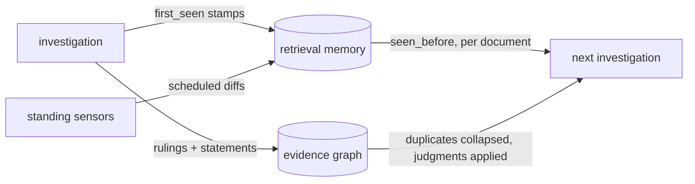

# Case study: the second investigation

<sub>[OmniSeek](../README.md)&nbsp;·&nbsp;[Worked examples](examples.md)&nbsp;·&nbsp;[Tools](tools.md)&nbsp;·&nbsp;[The source catalog](sources.md)</sub>

Search is stateless: ask the same question twice and it starts from zero twice. This case
study is about the other half of OmniSeek, the half that compounds. One real session
(2026-08-16), one working instrument that has been in daily use for weeks; every block below
is a verbatim output from that session, trimmed for the page. The question we handed the
agent is an ordinary one: map where credit assignment for multi-agent LLM systems stands
this week. What matters is not the topic. It is what OmniSeek already knew.

## One call, one ranked list, and a paper trail

```python
omniseek_search("credit assignment in multi-agent LLM systems", limit=8)
```

```json
"_meta": {
  "searched": 87,
  "elapsed_s": 11.0,
  "deduped": { "in": 435, "out": 8 },
  "index": { "lexical": 50, "vector": 50, "mode": "hybrid" }
}
```

Eleven seconds, 87 sources in parallel, 435 candidate records collapsed into 8 documents.
Not eight links: eight distinct claims on the field, because records of the same paper from
different indexes merge into one document that lists who corroborates it. And the ranking is
fused from two recalls, live lexical hits plus the local vector index, so a paraphrase with
no shared words still surfaces.

## OmniSeek recognized every result

All eight documents came back already stamped. Here is one, trimmed to the stamp:

```json
{
  "title": "Proximity-Based Multi-Turn Optimization: Practical Credit Assignment for LLM Agent Training",
  "source": "semantic_scholar",
  "metadata": {
    "also_in": ["crossref"],
    "corroboration": 2,
    "seen_before": true,
    "first_seen_at": "2026-07-03T12:27:09.662504+00:00"
  }
}
```

This instance first perceived that paper on July 3. Six weeks later, "is this new to us?" is
not something the agent estimates from vibes; it is a per-document fact with a timestamp. A
fresh install starts empty. This is what the same install feels like after six weeks of
ordinary use: nothing you have already seen gets to pretend it is news.

## Two indexes disagree about the same paper, out loud

```json
"conflicts": [{
  "topic": "citations",
  "source_a": "crossref",        "claim_a": "citations=0.0 ()",
  "source_b": "semantic_scholar", "claim_b": "citations=22.0 ()",
  "ratio": "inf"
}]
```

One index says that paper has never been cited; another counts 22. OmniSeek does not average
the two into a fake number and does not silently pick a winner. The disagreement is handed
over as data, ratio included, and the agent judges it (here: one index simply lags
arXiv-first papers). A single confident number would have been wrong; a visible conflict is
information.

## What it did not search, it says

```json
"source_diversity": { "absent_perspectives": ["audio", "news", "walled"] },
"excluded_relevant": [{
  "name": "agent_tooling_radar",
  "reason": "tooling/skill radar; watchtower + named only, kept out of research search",
  "why": "relevant but excluded; re-run naming it: sources=['agent_tooling_radar']"
}]
```

(`agent_tooling_radar` is an explicit-only monitor source; its `reason` field is quoted as
stored on the day of this session. The catalog has since reworded that entry in plainer
language; outputs here stay verbatim to their run.) A ranked list that merely looks complete is the most dangerous
kind of complete. So the router reports which perspectives this pass had none of, and which
deliberately-excluded sources matched the query anyway, each with the exact parameter that
reaches it. Coverage becomes something you read, not something you assume.

## A judgment, recorded once, inherited forever

The evidence graph held two nodes with the same title, "Quantile Credit Assignment". Two
`omniseek_read` calls settled it: same ICML 2023 paper, same authors, same abstract; one node
is the conference record, the other the same paper as imported from DBLP, the computer-science
bibliography. So the agent ruled (a node id is the graph's name for a remembered document:
source key plus that source's own id):

```python
omniseek_ruling(action="create",
                src="doc:mlrc:4yoLVter71", dst="doc:mlrc:vB9mHaHaHH", verdict="same")
```

```json
{ "created": true, "ruling": {
    "verdict": "same",
    "note": "same ICML 2023 paper (Mesnard et al., Quantile Credit Assignment): the conference record and the DBLP import of the same forum",
    "ruled_at": "2026-08-16T11:11:48.070749+00:00" } }
```

From now on, the graph's default working view collapses those two nodes into one. The ruling
is attributed, dated, and reversible, and the division of labor is strict: OmniSeek never
decides that two things are the same. It stores what the agent concluded and applies it at
read time.

## Stand a watch

```python
omniseek_sensor(action="create",
                query="credit assignment for multi-agent LLM systems", schedule="weekly")
```

The first manual run returned `"total_results": 15, "new_count": 15`: a fresh baseline, where
everything is new exactly once. From then on the sensor diffs mechanically and speaks only
when something changed. [Worked examples](examples.md) shows the same shape settling in: 15
new on day one, 3 the next day, then 0, which is exactly what a working watch looks like.

## The loop



Every investigation leaves OmniSeek sharper than it found it: stamps in the retrieval
memory, judgments in the evidence graph, watches on the frontier. The second investigation
does not start from zero. It starts from everything the first one settled.

## What OmniSeek did not do

It never summarized. It never decided which paper matters; the agent did. It reached,
stamped, collapsed, contradicted, and remembered, and the thinking stayed in the agent from
start to finish. Nothing that can hallucinate ever touched the data.

---

<div align="center"><sub><a href="../README.md">← back to the README</a></sub></div>
