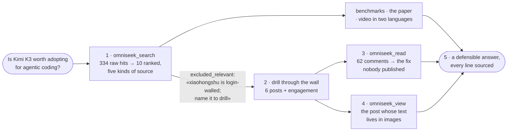
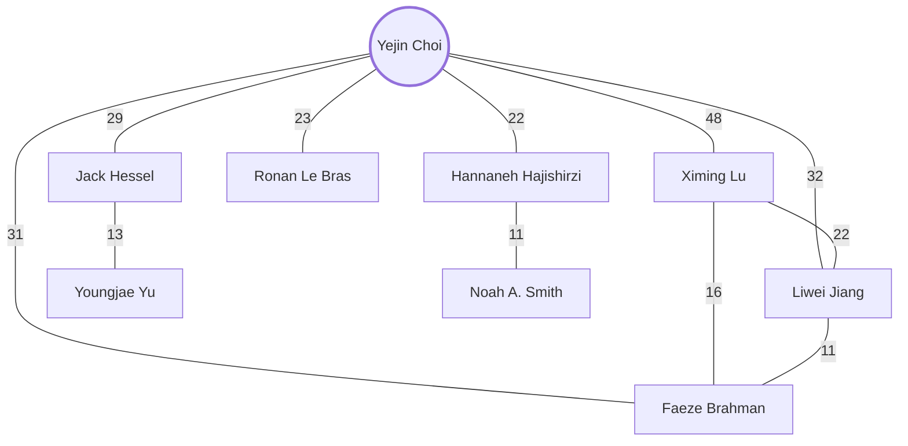

# Examples

<sub>[OmniSeek](../README.md)&nbsp;·&nbsp;[Tools](tools.md)&nbsp;·&nbsp;[Configuration](configuration.md)&nbsp;·&nbsp;[FAQ](faq.md)</sub>

Everything on this page came from one live OmniSeek instance and is quoted as returned: real queries, real outputs, real engagement numbers. Part 1 is a single session, shown in the order it happened.

---

## Part 1: one question, chased through four walls

The agent gets a question any engineering team might ask this month:

> *"Is Kimi K3 actually worth adopting for agentic coding?"*

Plain search returns launch coverage and benchmark posts: the marketing surface. Between the agent and the real answer stand four walls: a **language** wall, a **login** wall, a **comment-depth** wall, and a **pixel** wall. Here is the same question with perception:



### 1. The sweep

```
omniseek_search("Kimi K3 coding agent real-world experience")
```

One call fans out in parallel and deduplicates 334 raw hits into 10 ranked results, spanning five kinds of source at once:

| World | What came back |
|-------|----------------|
| Benchmarks | together.ai ran 904 DeepSWE rollouts: GPT-5.6 Sol leads pass@1, K3 wins pass@4 at 2.8x the solves per dollar |
| The paper | the Kimi K3 technical report on arXiv: 2.8T-parameter MoE, 104B activated, 1M-token context |
| Video, Chinese | a hands-on Bilibili build tutorial, and GLM-5.3's counter-release twelve days later claiming the open-weights coding crown |
| Video, English | two YouTube reviews asking "benchmark hype or real-world power?" |
| Code | an unofficial PyTorch reproduction trending on GitHub |

Note the query was English and half the best material is Chinese: the ranking is cross-lingual by default, so the agent never has to know which language the answer lives in.

And then the part of the response that is not results. The sweep skips login-walled sources by default, and **says so, with the exact call to go deeper** (excerpt):

```json
{
  "name": "xiaohongshu",
  "reason": "login-walled (CDP browser, account-rate-sensitive)",
  "why": "relevant but excluded; re-run naming it: sources=['xiaohongshu']"
}
```

The response is a map, not just a list. The agent reads it and goes through the wall.

### 2. Through the login wall

```
omniseek_search("Kimi K3", sources=["xiaohongshu"], raw=true)
```

This runs through the operator's own logged-in browser, on the operator's machine (the walled tier is **off** until you enable it with your own account: [how that works](walled-sources.md)). Six posts came back, dated within two weeks of the launch, each carrying the engagement signals a ranking can use:

| Post | Likes | Comments | Saves |
|------|------:|---------:|------:|
| Kimi's own launch note: weights and infra tech both public | 784 | 78 | 126 |
| "K3 is still not the strongest model" | 914 | 138 | 148 |
| "I declare Kimi K3 has overtaken the American models" | 161 | 44 | 67 |
| "The ¥99 plan, gone in 2 days 😅" | 130 | 64 | 114 |
| "Kimi's pricing manners are ugly" | 171 | 99 | 30 |
| "You people hyping Kimi: have you actually used it?" | 62 | **219** | 27 |

Read the shape of that table: the announcements hold the likes, the complaints hold the comments. An agent that can see engagement already knows where the information is.

### 3. Into the comments

```
omniseek_read("https://www.rednote.com/search_result/6a6215…")   # "gone in 2 days"
```

Full body plus 62 threaded comments. The post itself: a user who burned 80% of a month's quota in one day using K3 as a study-abroad advisor, while conceding the quality jump ("I ask it to re-check facts and logic afterwards; it mostly holds up. Hallucinations way down from 2.6"). Then, a few comments in, the thing no review article contains:

> **XiaoTao.** (26 likes): "得用他的code额度 99套餐的话比kimi客户端省四倍 199省20倍 chat是最费token的" *(use the code-plan quota: roughly 4x cheaper than the chat client on the ¥99 tier, 20x on ¥199; chat burns the most tokens)*
>
> **Blake** (the author, replying): "亲测确实大大节省我的额度！感谢分享！！" *(tested it, massively cut my burn, thank you!)*

Elsewhere in the thread, the failure mode with a price tag: "topped up ¥50 after my ¥199 ran out; gone in 20 minutes."

The mitigation and the sharpest cost datapoint both live in a comment section that search engines do not index, under a post they could not open, in a language the asker may not read.

### 4. The picture wall

The most-argued post in the table ("have you actually used it?", 219 comments) has a body of four hashtags. The text **is the images**, and the read result says so in so many words:

> 正文主要在 5 张图里 … 图片 URL 见 media 字段 *(the body is in the 5 images; URLs are in `media`; read them with vision)*

```
omniseek_view("https://sns-web-i10.rednotecdn.com/…, …", kind="images")
```

The agent reads the slides with its own vision. They turn out to be a paying user's breakdown (¥49 upgraded to ¥199, daily agentic-coding user, has tried Qwen 3.7, DeepSeek, GLM 5.2): the ¥49 tier cannot run K3 at all, ¥99 runs it with a truncated context window, only ¥199 is the full model; and self-deploying the open weights "starts at a few dozen high-end GPUs", so *open* is not a personal escape hatch. His closing verdict on coding agents: "它依旧不是唯一最优解" *(it is still not the single best answer)*: try pay-as-you-go first, subscribe to what you actually keep using.

A text scraper gets four hashtags from this post. Vision gets the whole argument.

### 5. What the agent now knows

Assembled, with provenance and weights:

- **The benchmark claim is real**: 904 independent rollouts, wins pass@4, 2.8x the solves per dollar (together.ai).
- **The lived experience has one dominant complaint**: quota burn, across ~600 comments of walled threads. The 4-20x mitigation exists, but only as a comment under a complaint.
- **The fine print was never in text**: which tier is actually K3 came from slides only vision could read.
- **The clock is ticking**: twelve days after launch, GLM-5.3 shipped claiming the same crown, first covered in Chinese.

That is not ten blue links. That is a position the agent can defend, with citations a human can check. To run investigations like this end to end, see [patterns](patterns.md), or install the ready-made Claude Code skill in [`skills/omniseek-investigate`](../skills/omniseek-investigate/SKILL.md).

---

## Part 2: the other senses

### It hears: speech nobody wrote down

```
omniseek_transcribe("https://www.bilibili.com/video/BV1Uy411i7eQ",
                    start="0", duration="60", language="zh")
```

A hallucination-taxonomy explainer with 32,000 views. Transcribed locally (bilingual ASR, no cloud, no API key), about a minute of wall clock for a minute of speech:

> 所以如果我们在微调过程没有控制好，其实也会增加大模型的幻觉。……大模型幻觉是阻碍大模型在产业界落地的一个非常重要的原因……那简单理解的话，幻觉其实对应到大模型的乱说。但这个乱说呢我们也可以把它分类成几大类型。那第一个分类我们可以把它归类为上下文的矛盾……

Before this call, that knowledge existed only as sound waves inside a video player. And the honest inverse: pointed at a launch video whose opening minutes turn out to be music over on-screen charts, it returns **zero characters**. Empty is an answer; invented text never is.

### It maps people: a name becomes a structure

```
omniseek_coauthors(["Yejin Choi"])
```

From public citation data, one call: 535 works, 28,938 citations, current affiliation Stanford, and the collaboration structure of her latest 200 papers, with joint-paper counts on every edge:



The cross-edges are the point: Lu, Jiang, and Brahman are not three separate collaborators, they are one tight sub-group, visible only because the tool also counts how the collaborators work with **each other**.

Now the same call on a junior researcher:

```
omniseek_coauthors(["Yi R. Fung"])
```

93 works. **54 of them are with Heng Ji**; the next collaborator counts 16. No academic database has an "advisor" field. The structure says it anyway, and your agent can read it in one call.

### It watches: only what is new

```
omniseek_sensor(action="create", query="multi-agent LLM credit assignment")
```

A standing query with a memory. Run it three times:

| Run | Result |
|-----|--------|
| 1 | 15 results, **15 new**: first sight of the field |
| 2 | **3 new**: stragglers as the fan-out settles |
| 3 | **0 new** |

From here it runs on its own schedule and speaks only when something appears. The agent stops re-reading the same fifteen results every morning; "is there anything new on X?" becomes a fact the sensor answers, not a judgment the agent repeats.

### It remembers: evidence that compounds

Mirrored records deduplicated into distinct voices, conflicting citation counts surfaced instead of silently averaged, judgments recorded once and carried into every later session. That story deserves its own page: **[the case study](case-study.md)**.

---

<div align="center"><sub><a href="../README.md">← back to the README</a></sub></div>
