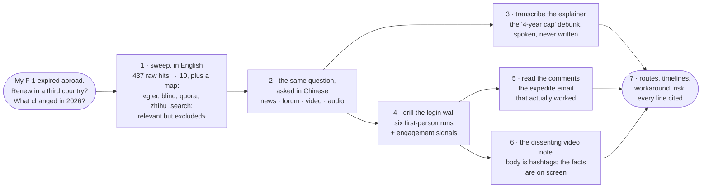
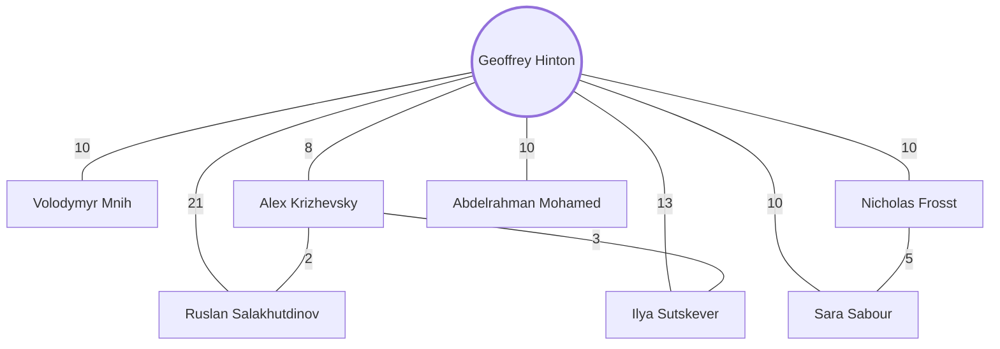

# Examples

<sub>[OmniSeek](../README.md)&nbsp;·&nbsp;[Tools](tools.md)&nbsp;·&nbsp;[Configuration](configuration.md)&nbsp;·&nbsp;[FAQ](faq.md)</sub>

Everything on this page came from one live OmniSeek instance and is quoted as returned: real queries, real outputs, real engagement numbers. Part 1 is a single session, shown in the order it happened.

---

## Part 1: one question, chased through five walls

The agent gets the kind of question people actually lose sleep over:

> *"My F-1 visa expired while I'm abroad. Can I still renew it in a third country, and what changed under the 2026 rules?"*

The official pages state the rule. What a person actually needs (which consulates have appointments, how long it really takes, what goes wrong) lives on the far side of five walls: a **language** wall, a **login** wall, a **comment-depth** wall, an **audio** wall, and a **pixel** wall.



### 1. The sweep, and the map it returns

```
omniseek_search("renew F-1 visa in a third country what changed 2026")
```

One call, 437 raw hits deduplicated into 10: immigration-news explainers of the 2026 rule change, one thread from a Chinese study-abroad forum, a policy history for lineage. Useful, but the most valuable part of the response is not a result at all (excerpt):

```json
{ "name": "gter",        "why": "relevant but excluded; re-run naming it: sources=['gter']" }
{ "name": "blind",       "why": "relevant but excluded; re-run naming it: sources=['blind']" }
{ "name": "quora",       "why": "relevant but excluded; re-run naming it: sources=['quora']" }
{ "name": "zhihu_search","why": "relevant but excluded; re-run naming it: sources=['zhihu_search']" }
```

The broad sweep holds back slow, quota-burning, and login-walled sources, and **says so, with the exact call to reach each one**. The response is a map, not just a list. The same `_meta` block also names the perspectives that came back absent (`source_diversity.absent_perspectives`: audio and walled, on this run). A dimension that returned nothing is a fact, not a gap to paper over.

### 2. The same question, in the language the answers live in

```
omniseek_search("F-1 签证 第三国签证 renewal 经验")
```

Same tool, Chinese. The mix flips: a study-abroad forum's visa archive (including a seven-offers-two-gap-years PhD saga with a per-country risk rundown), and a 15-minute Bilibili explainer of the new rules with 2,821 views. The agent did not need to know Chinese to get here; the ranking is cross-lingual, and the next two tools do not care what language a source speaks.

### 3. Hearing the nuance the headlines dropped

```
omniseek_transcribe("https://www.bilibili.com/video/BV1SaKN67EWy",
                    start="20", duration="70", language="zh")
```

Local ASR, no cloud, 70 seconds of audio in 27 seconds. The creator, on the "you can only stay 4 years now" headline sweeping social media:

> 网上很多人念叨什么彻底终结、全面禁止,这种标题党太夸张了……先拆俩最常见的胡说八道:一个是说最多只能待 4 年。这不是啊,他是说**初始停留期**最长 4 年,你符合条件可以申请延期,只是审批权不归学校管了,归移民局管了。
>
> *(the scary "4-year cap" is the INITIAL admission period; extensions still exist, the approval just moved from your school to the immigration service)*

That correction was spoken into a camera and never written down. Text search structurally cannot find it.

### 4. Through the login wall

```
omniseek_search("第三国签证 F1 经验", sources=["xiaohongshu"], raw=True)
```

`raw=True` is the drill switch: fetch this one named source, unbounded, instead of the ranked cross-source merge. It runs through your own logged-in browser, on your machine (the walled tier is **off** until you enable it with your own account: [how that works](walled-sources.md)). Six first-person accounts came back, one posted the day before this session:

| Post | Engagement |
|------|------------|
| "Bangkok F-1, approved at light speed!" | 26 comments |
| "Third-country US visa guide: F-1 in Italy" | 36 likes · 24 comments |
| "Bangkok B2/F1, shared" | posted **1 day ago** |
| "US F-1 in a third country: the pitfalls" (video note) | the dissent, see step 6 |
| "Getting a US F-1 in Germany: pitfalls" | 34 likes · 26 comments |
| "A silky-smooth F-1 run in Tokyo" | 36 likes · 51 saves |

The Bangkok post alone carries what no official page has: the full timeline (appointment booked June 15, interview July 8 at 8:30, **approved by 9:00**, passport in hand July 10) and live observations from the waiting line, down to which interview windows were refusing a third of B1/B2 applicants that morning.

### 5. Into the comments

```
omniseek_read("https://www.rednote.com/search_result/64a440eb…")   # the Milan post
```

Full body plus all 24 threaded comments (rednote is xiaohongshu's international name: same source, same login). The body is a field report from the slot war: a month of refreshing for an appointment, two paid slot-hunting services that found nothing, the slot finally self-caught at midnight; the observation that only Bosnia always shows open slots (and happens to be visa-free for Chinese passports); an expedite email to the consulate answered with polite nothing. Then, in the comments, the author comes back:

> **卡利斯托** (the author, returning): "今天还听到一个案例:一个申请 F1 学生签的同学先约到了一个靠后的日期,然后发邮件给大使馆申请加急成功了" *(heard today: book any late slot first, THEN email the consulate to expedite; for one F-1 applicant it worked)*

Also settled in the comments, never in the body: the visa came back valid for 5 years, and the passport took four working days. The single most actionable sentence of the whole investigation is a comment under someone else's post, behind a login, in Chinese.

### 6. The dissenting note, and both of its tracks

The third-country pitfalls note is the counter-voice: its text body warns that a 212(a)(6)(C) refusal in a third country can close the F-1 road almost entirely, and says: don't get cute, apply at home. But the body is four hashtags plus a video, and the read result flags exactly that, quoting the note itself:

> 干货在视频里,两条轨都要看……不少笔记的音轨只是背景音乐,事实全在画面上 *(the substance is in the video; read BOTH tracks. On many notes the audio is just background music and the facts are on screen)*

So the agent feeds the returned `video_url` to `omniseek_view` for the frames and `omniseek_transcribe` for the speech, and misses neither. And when a track is genuinely empty (music over charts), the transcript comes back as **zero characters**: empty is an answer; invented text never is.

### 7. What the agent hands back

Not a summary of ten links. A position, with provenance:

- **The rule, corrected**: the "4-year cap" is the initial period, extensions moved desks (spoken by an explainer with 2,821 views; the headlines got it wrong).
- **Three live routes**: Bangkok (booked to passport-in-hand in 25 days, interview to approval in 30 minutes), Milan (a month-long slot war, but doable and yields 5 years), Tokyo ("silky-smooth").
- **A workaround**: book late, then email to expedite: one confirmed case, from the author's own comment.
- **A standing risk**: the 212(a)(6)(C) warning, quoted as the dissent it is, not averaged away.

Every line traces to a handle, a timestamp, and an engagement count a human can check. To run investigations like this end to end, see [patterns](patterns.md), or install the ready-made Claude Code skill in [`skills/omniseek-investigate`](../skills/omniseek-investigate/SKILL.md).

---

## Part 2: the other senses

### It maps people: a name becomes a structure

```
omniseek_coauthors(["Geoffrey Hinton"])
```

From public citation data, one call: 378 works, 452,318 citations, and the collaboration structure of the most-mapped career in deep learning, joint-paper counts on every edge:



The cross-edges tell the stories the counts alone do not: Frosst and Sabour cluster together (the capsule-networks line), and the Krizhevsky-Sutskever-Hinton triangle is AlexNet, visible as pure structure.

Now the same call on one of the students:

```
omniseek_coauthors(["Ilya Sutskever"])
```

107 works, 219,157 citations, and a ranked list that reads like a career in three acts: Hinton 16 and Radford 16 tied at the top, then Zaremba 12, Abbeel 12, Vinyals 11, Le 10. The Toronto years, the Google years, and the OpenAI years, reconstructed from nothing but who he wrote with, in one call. (The Hinton edge reads 13 from Hinton's side and 16 from Sutskever's: each list is counted over its own author's recent-works window, so the two ends of one edge can see slightly different slices. The tool reports what each window contains; it never averages them.)

### It watches: only what is new

```
omniseek_sensor(action="create", query="multi-agent LLM credit assignment")
```

A standing query with a memory. Run it three times:

| Run | Result |
|-----|--------|
| 1 | 15 results, **15 new**: first sight of the field |
| 2 | **3 new**: stragglers as the fan-out settles |
| 3 | **0 new** |

From here it runs on its own schedule and speaks only when something appears. "Is there anything new on X?" becomes a fact the sensor answers, not a morning ritual the agent repeats.

### It remembers: evidence that compounds

Mirrored records deduplicated into distinct voices, conflicting citation counts surfaced instead of silently averaged, judgments recorded once and carried into every later session. That story deserves its own page: **[the case study](case-study.md)**.

---

<div align="center"><sub><a href="../README.md">← back to the README</a></sub></div>
