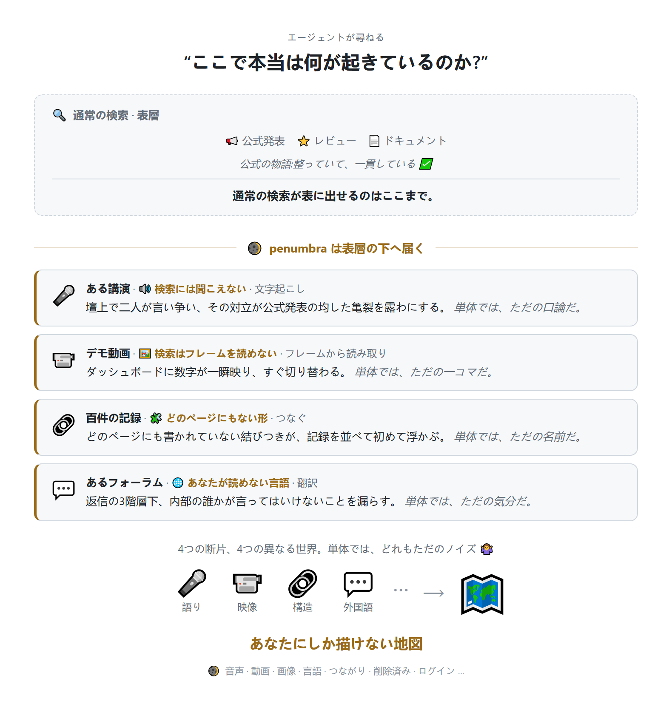

<div align="center">

<picture>
  <source media="(prefers-color-scheme: light)" srcset="../../assets/logo-icon.png">
  
</picture>

# penumbra

**表層の、その下へ。**

AIエージェントのための、セルフホスト型ディープ検索MCPサーバー。

[](https://github.com/Battam1111/penumbra/actions/workflows/ci.yml)
&nbsp;[](../../LICENSE)
&nbsp;
&nbsp;
&nbsp;

[仕組み](#仕組み) · [クイックスタート](#クイックスタート) · [設定](#設定) · [コントリビュート](#コントリビュート)

**Languages:** [English](../../README.md) · [中文](README_zh.md) · 日本語

</div>

---

あなたのエージェントが届く範囲でしか、動けない。普通の検索が届くのは表層だけだ:文字になっていて、読める言語で書かれていて、まだそこにある、その範囲だけ。

表層の下には:あるスタートアップに入るべきか迷っている、公開情報はどれも好調だと言っている;3ヶ月前のポッドキャスト、52分目で創業者がふと漏らした「ランウェイはあと9ヶ月くらい」、文字起こしされたことはない。レビューが軒並み五つ星の製品を検討している;デモ動画で、実際のパフォーマンス指標が画面に2秒だけ映った、公称値の10倍悪い、誰も声に出さなかった。ある街に引っ越すか決めようとしている、旅行ブロガーは皆住みやすいと言う;地元の人がとっくにフォーラムに本当のことを書いていた、あなたの読めない言語で。

すべて、そこにある。誰も触れていない。

<h3 align="center">それが半影領域(ペナンブラ)だ。</h3>

<div align="center">

あなたのエージェントが届く範囲と、実際に存在するものの間:広大で、半分だけ光が当たっている。
秘密ではない。死角だ:
**知識はそこにある、あらゆる場所に散らばっていて、ただ表層からは見えないだけ。**

</div>

<br>

**なぜ届かないのか?** 語られたもの、検索には聞こえない;画面に映ったもの、検索には読めない;別の言語で書かれたもの、あなたには読めない;ログインすれば見えるもの、検索は入れない;昨日あったもの、今日にはもうない。普通の検索は、どの壁にもぶつかる。自分の手で一つずつ取りに行く?いつかは届く。ただ、そんなに時間がない。

**Penumbraは、あなたのエージェントにその届く力を与える:** 語られたものを文字に起こし、画面に一瞬映ったものを読み取り、別の言語で書かれたものをあなたの言葉に置き換え、ログインしなければ見えない場所に入り込み、消されてしまったものを取り戻し、何百もの記録に散らばったものをつなぎ合わせる。届かなかったものを、一度で持ち帰る。

**だが、断片の山だけでは知識にならない。** 百の散らばった発見は、そろうまではただのノイズだ:独立した複数の角度が、同じ結論を指し示す、どの一つも全体を語ってはいない。Penumbraは、それぞれの断片がどこから来たか、いつのものか、どこかの反響かどうかを記し、異なるソースに散らばった線を織り合わせる:同じ名前が無関係な三つの場所に現れる、並べて初めて通る時系列、記録の隙間に隠れた関係。残りは、あなたのエージェントが、あなただけの一枚の地図に組み立てる。

**想像してみてほしい、何が答えられるようになるかを。** 毎日使っているあの製品、絶賛の嵐だが、そのうち何件が本当に独立したレビューか確かめられるか?業界で誰もが口にするあの「内部情報」、一次情報なのか、それとも同じ人間が三つのプラットフォームで書いたものなのか?あなたに直接関わるリスクが、読めない言語の世界でもう2年も議論されていて、あなたはその存在すら知らなかった?最初に思いついたのは、これくらいのものだ。

<div align="center">

*半影領域は、ずっとそこにあった。*

**今、届く。**

</div>

---

## 仕組み

<div align="center">
  <picture>
    <source media="(prefers-color-scheme: dark)" srcset="../../assets/demo-ja-dark.png">
    
  </picture>
</div>

エージェントはMCPで接続する。エントリポイントは **`penumbra_search_ranked`**;`penumbra_list_sources()` が利用可能な能力を表示する。カタログはオープンかつ成長し続ける:各ソースは通常の検索に勝つことで採用される。完全なツール一覧は **[tools](../tools.md)** にある。

## クイックスタート

### Docker(推奨)

```bash
git clone https://github.com/Battam1111/penumbra.git && cd penumbra
docker compose up -d
docker compose logs penumbra        # 初回起動時に表示される bearer token をコピー
curl -s http://127.0.0.1:8765/healthz
```

MCPクライアントを `http://127.0.0.1:8765/mcp` に向け、ヘッダー
`Authorization: Bearer <token>` を付与する。トークンは初回起動時に自動生成され、
`~/.penumbra/credentials/http.json` に保存される(Docker では `./.penumbra/credentials/http.json` にマウントされる)。

オプション拡張(ライセンスへの同意が必要、[NOTICE](../../NOTICE) 参照):
`docker-compose.yml` で `EXTRAS="[pdf,asr,walled]"` をビルド引数に指定。

### Dockerなし

```bash
python -m venv .venv && . .venv/bin/activate     # Windows: .venv\Scripts\activate
./bootstrap.sh                                    # インストール + chromium + token + デフォルトprofile
python -m penumbra.serve_http                      # http://127.0.0.1:8765 で起動
```

Windows では `bootstrap.sh` を Git Bash または WSL で実行してください(POSIX シェルスクリプトです)。Docker が最も簡単な経路です。

Linux常駐サービスは [`deploy/penumbra.service`](../../deploy/penumbra.service) を参照。

Penumbra は `127.0.0.1` にバインドし、すべてのリクエストに bearer token を要求する。
リバースプロキシなしで公開しないこと([SECURITY.md](../../.github/SECURITY.md))。

## 設定

Penumbraは**カタログ優先**設計:設定なしでも、すべての安全なソースはオン、ログインウォールソースはオフ。調整はすべて一つのファイル `~/.penumbra/profile.json`([`profile.example.json`](../../profile.example.json) から初期化)で、ソース名・ドメイン・地域・アクセス階層ごとに行う:

| 階層 | デフォルト |
|------|-----------|
| **free**(公開、キー不要) | **オン** |
| **keyed**(あなたが用意する無料/有料の API キー) | キー設定でオン |
| **walled**(あなたが権利を持つログイン) | **オフ**;ブラウザは自前 |
| **circumvention** | **オフ**;デフォルトパックに含まれない |

詳細は **[configuration](../configuration.md)** に、ログイン必須ソースへのブラウザログインは **[walled sources](../walled-sources.md)** にある。

## コントリビュート

[CONTRIBUTING.md](../../.github/CONTRIBUTING.md) を参照。新しいソースの基準:特定のモード
(structure / unwall / transcribe / recall / monitor)で通常の検索に勝つこと。
壊れたソースの修復の基準:低い。ぜひ修復を。プッシュ前に `python tests/smoke.py` を実行。

参加することで[行動規範](../../.github/CODE_OF_CONDUCT.md)に同意したものとみなされます。

<div align="center">

---

**表層の、その下へ。**

[Apache-2.0](../../LICENSE) · [NOTICE](../../NOTICE) · [Security](../../.github/SECURITY.md)

</div>
