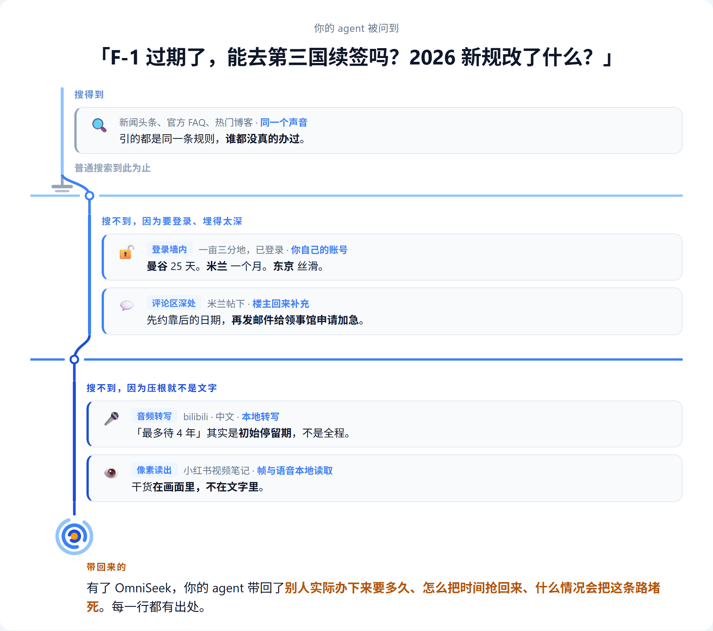

<div align="center">

<picture>
  <source media="(prefers-color-scheme: light)" srcset="../../assets/logo-icon.png">
  
</picture>

# OmniSeek

**你的 agent,找到搜索找不到的东西。**

答案就躺在某期播客的第 47 分钟、某条评论的第三层回复里、登录墙后面、另一种语言里。你的 agent 照样把它拿回来。

<sub>自托管感知 MCP 服务器 · 一条连接</sub>

[](https://github.com/Battam1111/omniseek/actions/workflows/ci.yml)
&nbsp;[](../../LICENSE)
&nbsp;
&nbsp;
&nbsp;

[快速开始](#快速开始) · [工具](#工具) · [配置](#配置) · [参与](#参与)

**Languages:** [English](../../README.md) · 中文 · [日本語](README_ja.md)

</div>

---

搜索给你的 agent 的,是已被索引的网页:单一语言、纯文本,到此为止。

OmniSeek 继续求索:穿过语言、登录墙、评论区、音频与像素,全程都在你自己的机器上。

<div align="center">
  <picture>
    <source media="(prefers-color-scheme: dark)" srcset="../../assets/demo-zh-dark.png">
    
  </picture>
</div>

它能听(本地双语转写,不走云),能看(图片与视频帧,视觉直读),能跨语言(中文查询返回英文结果,反之亦然),能进登录墙(你的凭证,你的机器,默认关闭),还能记住(持久的检索记忆,外加一张带类型、可溯源的证据图谱)。

跨语言依赖 OmniSeek 随你使用而积累的索引,所以新装的实例是从地板起步。公开 benchmark 跑的正是这样一台新装实例,它那个跨语言数字是最冷的情况,不是常态。

[目录](../sources.md)是 OmniSeek 所及一切的策展名册;里面的每一个源,都是靠在五件事之一(结构化、进墙、转写、召回、监测)上打赢普通搜索才拿到位置的:引用图谱、监管文件、登录墙论坛、中文视频。目录生来就会生长:内置的 curator 流水线负责探测、判决、准入新源,并让退化的源退役。

**[真实例子、真实输出](../examples.md)** · **[一次完整调查](../case-study.md)** · **[Benchmark](../../bench/DESIGN.md)**([最新结果](https://github.com/Battam1111/omniseek/blob/health-data/bench/RESULTS.md))· **[源健康,周更](https://github.com/Battam1111/omniseek/blob/health-data/README.md)**

---

## 快速开始

### Docker(推荐)

```bash
git clone https://github.com/Battam1111/omniseek.git && cd omniseek
docker compose up -d
docker compose logs omniseek        # 首次启动时打印 bearer token
curl -s http://127.0.0.1:8765/healthz
```

把你的 MCP 客户端指向 `http://127.0.0.1:8765/mcp`,带上 `Authorization: Bearer <token>`。token 在首次启动时生成,存于 `~/.omniseek/credentials/omniseek_http.json`(用 compose 跑的话,宿主机上就是 `./.omniseek/credentials/omniseek_http.json`)。

从这里分两条路。预构建核心镜像(`docker pull ghcr.io/battam1111/omniseek`,amd64 + arm64)无需构建,带全部核心感官;它是 Apache 干净版,不含 PDF 阅读、听觉(ASR + 视频帧)与登录墙源。想要这些 extras 才需要本地构建:设好 `EXTRAS="[pdf,asr,walled]"` 跑 `docker compose build`,再 `up -d`(首次构建会一并拉取无头 Chromium,之后启动即时)。建议同时设置 `OMNISEEK_CONTACT_EMAIL`,Crossref、SEC、Unpaywall 会给礼貌联系方式一条快速通道。

### 不用 Docker

```bash
python -m venv .venv && . .venv/bin/activate
scripts/bootstrap.sh
python -m omniseek.serve_http
```

裸安装即 **Core** 档:全部免钥 API 与静态源、文档阅读(除 PDF)、词面记忆索引。`pip install "omniseek[pdf,asr,recall,ocr]"` 唤醒 **Research** 档(PDF、听觉、跨语言向量、OCR);`omniseek[walled]` 加上登录墙档,不带上你自己的账号它保持关闭;`omniseek[all]` 全要。服务器每次启动都会打印哪些感官在岗、哪些休眠。

Windows 上请在 Git Bash 或 WSL 里跑 `bootstrap.sh`;Docker 是最省事的路。要挂常驻 Linux 服务,见 [`deploy/omniseek.service`](../../deploy/omniseek.service)。

偏好 stdio?安装同时装入 `omniseek` 命令,直接以 stdio 讲 MCP,适合由客户端自行拉起服务器的场景;[`Dockerfile.stdio`](../../Dockerfile.stdio) 是它的容器包装。

OmniSeek 绑定 `127.0.0.1`,每个请求都要 bearer token。没有反向代理不要对外暴露([SECURITY.md](../../.github/SECURITY.md))。

---

## 工具

一条 MCP 连接;里面没有模型,也没有 agent 循环。模型思考,harness 跑循环,OmniSeek 够到。从 `omniseek_search` 开始;用 `omniseek_sources` 看有什么可用。

| 工具 | 干什么 |
|------|--------|
| `omniseek_search` | 全目录扇出、去重、排序。跨语言(语义 + 词面)。 |
| `omniseek_read` | 把任意 URL 或文档(网页、PDF、arXiv)归一为干净文本。 |
| `omniseek_view` | 用视觉读图片、文档插图、视频帧。 |
| `omniseek_transcribe` | 本地转写音视频。双语 ASR,可按时间戳切片。 |
| `omniseek_field_skeleton` | 画一个研究领域的引用邻域:根基与前沿。 |
| `omniseek_resolve_identity` | 把人名解析为跨库的候选作者 ID。 |
| `omniseek_coauthors` | 按合著篇数画一位研究者的合作网络。 |
| `omniseek_institution_cohort` | 列出某实验室里活跃发表的人,可按领域收窄。 |
| `omniseek_paper_enrich` | 一篇论文的开放获取 PDF、撤稿状态、被引数。 |
| `omniseek_paper_recommend` | 语义相似论文(SPECTER 向量),关键词搜不到的那种。 |
| `omniseek_graph` | 查累积的证据图谱:find、neighborhood、between、since、similar。 |
| `omniseek_sensor` | 常驻查询 + 新颖性检测。只在有新东西时告诉你。 |
| `omniseek_ruling` | 记录同一性裁决(是/不是同一实体),图谱读取时应用。 |
| `omniseek_statement` | 记录有向关系,图谱带着它走。 |
| `omniseek_curator_act` | 源的生命周期:提交、探测、判决、准入、退役。 |
| `omniseek_curator_view` | 读源准入队列或单源审计档案。 |
| `omniseek_gather` | 多件工具并行跑,一次返回。 |
| `omniseek_sources` | 列出与路由:领域、地区、能力、健康。 |

登录墙层没有专属工具:按源开启后,同一个 `omniseek_search(..., sources=["xiaohongshu"], raw=True)` 会经你自己已登录的浏览器执行。见 [walled sources](../walled-sources.md)。

完整参考见 **[tools.md](../tools.md)** · **[FAQ](../faq.md)**

在用 Claude Code?[`skills/omniseek-investigate`](../../skills/omniseek-investigate/SKILL.md) 把调查方法论(扫、钻、结构化)打包成了现成的 skill。

---

## 配置

OmniSeek 是**目录优先**的:零配置时,每个无害源都开着,登录墙源都关着。全部调节集中在一个文件 `~/.omniseek/profile.json`([示例](../../deploy/profile.example.json)):

| 层级 | 默认 |
|------|------|
| **free**(公开,无需 key) | **开** |
| **keyed**(你提供的免费或付费 API key) | key 配好即开 |
| **walled**(你持有的登录) | **关**;浏览器你自己带 |
| **circumvention**(绕过访问控制) | **关**;默认包里一个也没有 |

完整参考:**[configuration](../configuration.md)** · **[walled sources](../walled-sources.md)** · **[legal posture](../LEGAL-POSTURE.md)**

---

## 为什么自托管

没有 OmniSeek 云端:无遥测、无账号、无中转。查询离开你的机器时,只以直连请求的形式发往你启用的那些源,OmniSeek 不往这条路径里加任何第三方。墙内源的凭证只住在你自己的浏览器里、只呈给它所属的站点;OmniSeek 不存储、不上传、也根本看不到你的密码。日积月累的检索记忆与证据图谱是你机器上的本地文件:哪天停用 OmniSeek,一切仍归你。这不是功能开关,是架构本身。

---

## 参与

见 [CONTRIBUTING.md](../../.github/CONTRIBUTING.md)。新源的门槛:必须以某种模式(structure / unwall / transcribe / recall / monitor)打赢普通网页搜索。修一个退化源的门槛:很低,欢迎来修。push 前跑 `python tests/smoke.py`。

参与即同意[行为准则](../../.github/CODE_OF_CONDUCT.md)。

<div align="center">

---

**你的 agent,找到搜索找不到的东西。**

[Apache-2.0](../../LICENSE) · [NOTICE](../../NOTICE) · [Security](../../.github/SECURITY.md) · [引用本项目](../../CITATION.cff)

</div>
