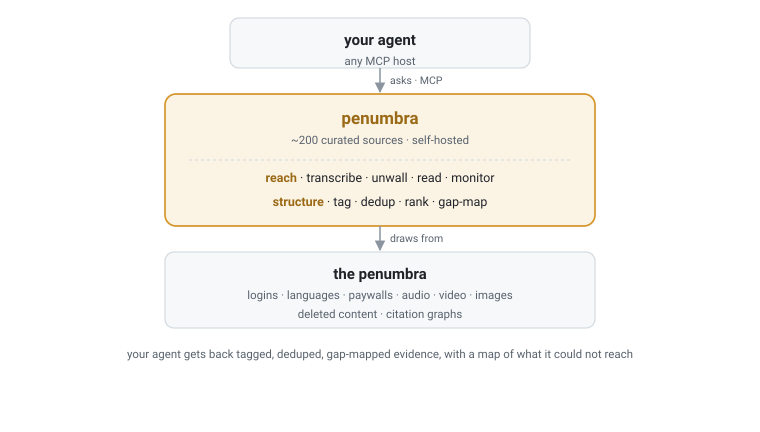

<div align="center">

<picture>
  <source media="(prefers-color-scheme: light)" srcset="../../assets/logo-icon.png">
  
</picture>

# penumbra

**表层之下。**

面向 AI agent 的自托管深度检索 MCP 服务器。

[](https://github.com/Battam1111/penumbra/actions/workflows/ci.yml)
&nbsp;[](../../LICENSE)
&nbsp;
&nbsp;
&nbsp;

[快速开始](#快速开始) · [工作原理](#工作原理) · [配置](#配置) · [工具](#工具) · [贡献](#贡献)

**Languages:** [English](../../README.md) · 中文 · [日本語](README_ja.md)

</div>

---

你只能基于你找到的东西行动。你能找到的,只有表层。

表层之下:一期播客的第 47 分钟有你需要的洞察,从没被转写过。一份付费墙后的 PDF 里有改变一切的数字。一个你不懂的语言写成的论坛帖,上周被删了,里面有人说清了你正要踩的坑。

都在。都可以被找到。无人触及。

<h3 align="center">这就是半影区。</h3>

<div align="center">

任何搜索给你看到的,和实际存在的之间,那片巨大的若隐若现的地带。
不是机密。不是开放网络。
**是中间那片:知识真实存在,散落各处,结构性地碰不到。**

</div>

<br>

**为什么碰不到?** 锁在音频、视频、图片里,文本搜索解析不了。用你不懂的语言写成。藏在登录墙和付费墙后面。而且是流动的:昨天还在的帖子,明天可能就没了。无论你用什么工具,撞上的都是同样的壁垒。

**Penumbra 穿过它们。**

一个自托管的深度检索引擎。转写音频,消化文档,从视频和图像中提取,遍历引用图谱,监控变化。一个不断生长的开源策展源目录(目前数百个,任何人可扩展),横跨深层网络。讲 MCP 协议,任何 AI agent、工作流或应用直接接入。

**但碎片不是知识。** 一百条散落的发现是噪声。信号,是当一条英文薪资帖、一条中文论坛上提到的招聘冻结、一期未转写播客里的一句无心之言,从三个独立角度指向同一个结论,而没有任何单一来源能看到全貌。Penumbra 为你的 agent 提供做到这一点所需的一切:每条发现标注出处、时间戳和独立性,附带对"哪里没能触及"的精确度量。你的 agent 推理的依据,是结构化的、可溯源的、标注了盲区的证据,而非对表层的自信复述。

**想象一下,什么问题变得可以回答了。** 你的领域里谁认识谁,跨越每一种语言追踪? 一份监管文件和一场翻译过的财报会议之间,藏着什么信号? 那些需要数年耳濡目染的内行知识,几个月能不能系统积累? 在表层:无解。在半影区:可解。这些不过是我们想到的第一批。

<div align="center">

*优势从来不在于谁更聪明。*
*在于谁能进入半影区。*

**现在,你能了。**

</div>

---

## 快速开始

### Docker(推荐)

```bash
git clone https://github.com/Battam1111/penumbra.git && cd penumbra
docker compose up -d
docker compose logs penumbra        # 首次启动时会打印 bearer token,复制它
curl -s http://127.0.0.1:8765/healthz
```

将你的 MCP 客户端指向 `http://127.0.0.1:8765/mcp`,携带请求头
`Authorization: Bearer <token>`。token 在首次启动时自动生成,
存储在 `~/.penumbra/credentials/http.json`(Docker 下挂载为 `./.penumbra/credentials/http.json`)。

可选扩展(你需接受其许可,参见 [NOTICE](../../NOTICE)):
在 `docker-compose.yml` 中设置 `EXTRAS="[pdf,asr,walled]"`。

### 不使用 Docker

```bash
python -m venv .venv && . .venv/bin/activate     # Windows: .venv\Scripts\activate
./bootstrap.sh                                    # 安装 + chromium + token + 默认 profile
python -m penumbra.serve_http                      # 启动于 http://127.0.0.1:8765
```

Windows 上请在 Git Bash 或 WSL 里运行 `bootstrap.sh`(它是 POSIX shell 脚本);Docker 是最省事的路径。

Linux 常驻服务参见 [`deploy/penumbra.service`](../../deploy/penumbra.service)。

## 工作原理

Penumbra 是**基础设施,不是应用**:原始互联网和你的 AI agent 之间的检索层。

<div align="center">
  <picture>
    <source media="(prefers-color-scheme: dark)" srcset="../../assets/architecture_dark.svg">
    
  </picture>
</div>

Penumbra 在目录中扇出、穿越壁垒、跨独立上游去重,返回结构化证据 + 一份"哪里没能触及"的地图。推理由你的 agent 做;Penumbra 只保证它推理的依据是深度,而非表层。

源目录**开放且持续生长**:目前已有数百个策展源,任何人都能增加。每个源靠一种特定模式(structure、unwall、transcribe、recall、monitor)胜过普通搜索来赢得一席之地,而非复述搜索本就能返回的内容。

## 你会得到什么

一次广播调用,在整个目录上去重 + 排序,并附一份"哪里没能触及"的台账。下面是 `penumbra_search_ranked("retrieval augmented generation survey")` 的一段真实(已精简)返回:

```jsonc
{
  "query": "retrieval augmented generation survey",
  "count": 12,
  "documents": [
    {
      "source": "openreview",
      "title": "Graph Retrieval-Augmented Generation: A Survey",
      "url": "https://openreview.net/forum?id=9ldXNHQFMl",
      "date": "2024-01-01T00:00:00Z",
      "metadata": {
        "corroboration": 5,                                 // 同一篇工作被 5 个独立上游各自命中
        "also_in": ["dblp", "hackernews", "openalex", "youtube"],
        "merge_basis": "title",
        "_rank": 0.68
      }
    },
    {
      "source": "github_trending",
      "title": "taichengguo/LLM_MultiAgents_Survey_Papers",
      "url": "https://github.com/taichengguo/LLM_MultiAgents_Survey_Papers",
      "signals": { "stars": { "value": 1282, "kind": "engagement", "computed_by": "source:github_trending/stars" } },
      "metadata": { "live_sources": ["github_trending"], "_rank": 0.76 }
    }
    // ... 还有 10 条
  ],
  "_meta": {
    "searched": 91,                          // 本次查询的源数
    "elapsed_s": 26.1,
    "deduped": { "in": 402, "out": 12 },     // 402 条原始命中按上游身份去重为 12 条
    "empty": ["core", "bluesky", "acl_anthology", "..."],  // 返空(没配密钥,或无匹配)
    "excluded_relevant": []                  // 与本查询相关的墙内/慢速源,各带一个 sources=[...] 重跑提示
  }
}
```

独立性是具体的:同一篇工作从多个上游浮现时,会折叠成一条,带上 `corroboration`(几个来源)和 `also_in`(是哪些),让你的 agent 把"5 源佐证的综述"看得比孤证更重。`_meta` 就是盲区台账:查了什么、哪些返空、哪些被排除。

## 配置

Penumbra 采用**源目录优先**设计:无配置时,所有良性源开启、登录墙源关闭。全部调节集中在一个文件
`~/.penumbra/profile.json`(从 [`profile.example.json`](../../profile.example.json) 播种),按源名、领域、地区、访问层级缩放:

| 层级 | 默认 |
|------|------|
| **free**(公开,无需密钥) | **开** |
| **keyed**(你提供的免费/付费 API 密钥) | 配好密钥即开 |
| **walled**(你有权访问的登录墙) | **关**;自带浏览器 |
| **circumvention** | **关,不随附** |

完整参考见 **[configuration](../configuration.md)**;墙内源登录见 **[walled sources](../walled-sources.md)**。

## 工具

优先用 **`penumbra_search_ranked`**(整个目录去重 + 排序的一张表,查"X 的最佳/最新"的默认)。`penumbra_list_sources()` 返回活的能力索引。搜索、论文、引用、人物、文档、音频、监控:完整分组清单见 **[tools](../tools.md)**。

## 安全与责任

- **默认回环、token 守门。** 绑定 `127.0.0.1`,无 bearer token 拒绝启动,任何非回环绑定都大声警告。未经反向代理不要对外暴露。
- **默认不可信。** 出站请求经 SSRF 防护;Penumbra 返回的一切都是外部数据、绝非指令;`penumbra_read_document` 沙箱化到白名单收件箱。
- **你的责任。** Penumbra 以你自己 agent 的身份检索,须守你所在司法辖区的法律与各站条款。完整姿态见 [SECURITY.md](../../.github/SECURITY.md) 与 [NOTICE](../../NOTICE)。

## 贡献

参见 [CONTRIBUTING.md](../../.github/CONTRIBUTING.md)。新源的门槛:必须通过一种模式
(structure / unwall / transcribe / recall / monitor)胜过普通搜索。
修复衰变源的门槛:低,欢迎。提交前跑 `python tests/smoke.py`。

参与即表示你同意遵守[行为准则](../../.github/CODE_OF_CONDUCT.md)。

<div align="center">

---

**表层之下。**

[Apache-2.0](../../LICENSE) · [NOTICE](../../NOTICE) · [Security](../../.github/SECURITY.md)

</div>
